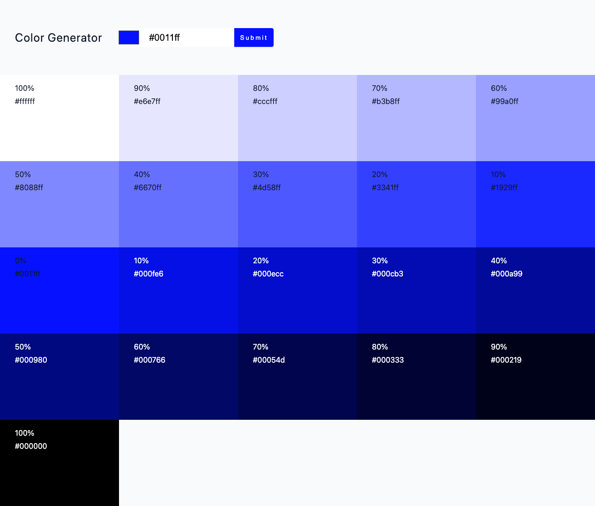

# Color Generator

Color Generator is a simple web application built with Vite and React that allows users to generate colors palettes or choose from desired color. It's a handy tool for designers and developers who need quick color references or inspiration.

## Features

- **Random Color Generation:** Generate a color palette with a single click.
- **Custom Color Input:** Manually input a color using HEX values.
- **Custom Color Picker:** Picking a color to generate a color palette.
- **Copy to Clipboard:** Easily copy the generated color in color palette to your clipboard with click on the color.
- **Responsive Design:** Works well on all screen sizes.

## Technologies Used

- **Vite:** Fast build tool for modern web projects.
- **React:** A JavaScript library for building user interfaces.
- **CSS:** Styling of the application.

## Installation

To run this project locally, follow these steps:

1. Clone the repository:

   ```bash
   git clone https://github.com/Lanmidev/color-generator.git
   ```

2. Navigate to the project directory:

   ```bash
   cd color-generator
   ```

3. Install the dependencies:

   ```bash
   npm install
   ```

4. Start the development server:

   ```bash
   npm run dev
   ```

   The application will be available at `http://localhost:3000`.

## Usage

- Click the "Submit" button to create a color palette.
- Use the color input field to enter a custom color in HEX format or click in Color Picker to choose a color.
- Click on the color in palette to copy the color code to your clipboard.

## Screenshot


